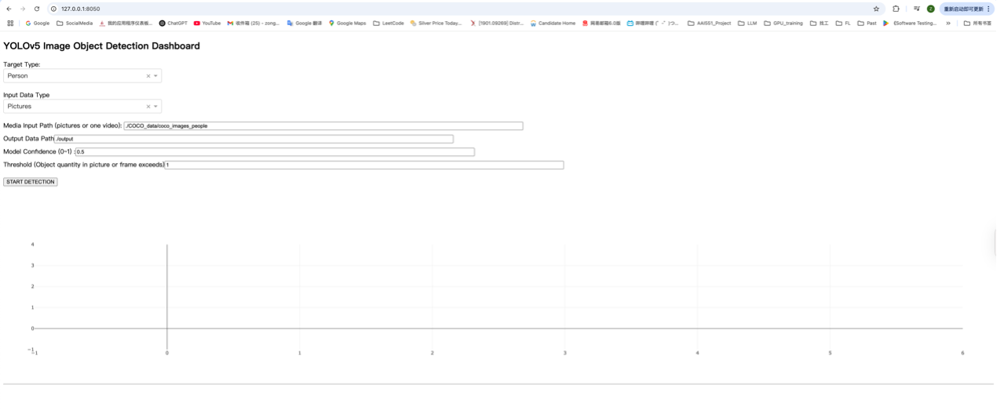
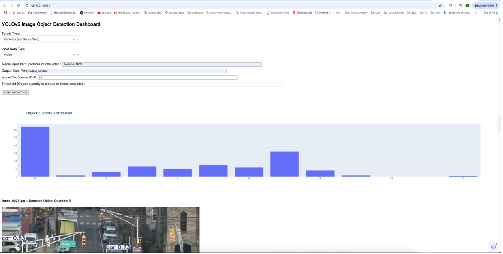
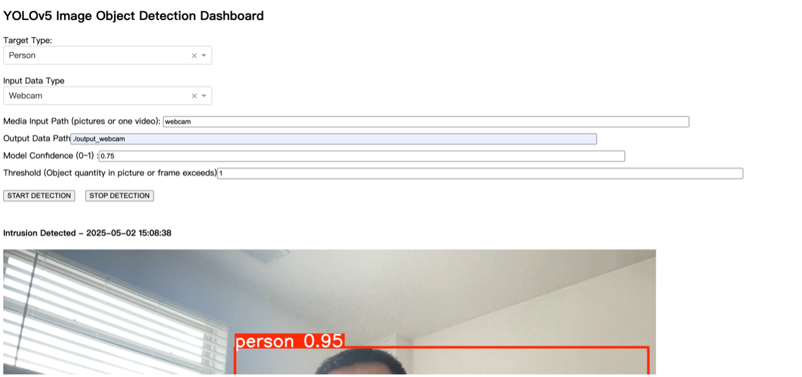
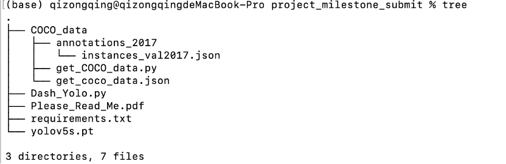

## AAI 551 Project deployment instructions

### Step 1: Environment preparation and download code.
GitHub Link:
https://github.com/ZongqingQi/AAI551.git

Users can get the code by running the command in the terminal: 
git clone https://github.com/ZongqingQi/AAI551.git

Then, install all the required packages
You can find a requirements.txt file in the zip folder. Open your terminal and run the command below:
pip install -r requirements.txt
Note: The Internet is required for downloading the Yolo Model when the program is running.

### Step 2: Download the COCO picture dataset. (optional)
Yes, you can download this dataset, which is helpful, but you can also use your image set; the directory structure is like a folder containing several pictures and remembers only pictures.

If you decide to download this dataset, run the script get_COCO_data.py. The parameters are read from the JSON file get_coco_data.json.
Parameters by sequence from top to down are:
1)	annotation file path
2)	data type you want (in this project, we support people, pets, trains, and vehicles)
3)	The total number of pictures you want to download.
4)	The object quantity contained in the picture is what you want.
5)	The first part of the folder path name, you can change it as you want.
	quantity of objects
Note: This dataset is used to present how the platform works. In reality, you can input any picture or video dataset if it obeys the directory structure just mentioned.

I can think about some scenarios:
First is railroad intrusion by animals, humans, or vehicles. The system can detect the invasion of the railroad and let someone know if the data from the camera can be used as input data.
Second is the alarm of the corded situation. If the camera detects too many people in one section of a public place, someone can use the data from the cameras to take action to prevent a dangerous situation like Stampede.
Or, in other scenarios, you can utilize this platform.

### Step 3: Start the platform.
Start the Yolo Model detection script by executing python Dash_Yolo.py in your terminal.
And then open your browser and go to http://127.0.0.1:8050/ to see the GUI webpage.

### Step 4: Start the image detection process.
You should see a webpage like this if you successfully started the platform.

1)	Choose the target type you want to detect.
2)	Choose the data type you want to input, pictures or videos
3)	Fill the Media Input Path folder with pictures or a path to a video.
4)	Fill in the Output Data Path where you want to store the frames from video or pictures, which have boxes drawn on them.
5)	Fill the Model confidence range 0 to 1
6)	Fill in the Threshold you want (You want the pictures/Frames to contain over how many objects you want. )
7)	Finally, click the START DETECTION button and wait. At this time, you may see some output from your terminal.

### Step 5: Check the results.
If it runs successfully, you can see the refreshed page like this:

You can see the statistics of the object quantity of all input data.
You can scroll down to see which picture or video frame reaches the threshold.

### Step 6: Use the Live Stream mode.
This mode is used for real-time monitoring purposes like railway intrusion detection. For safety reasons, railroads and some industrial sites must ensure that no people, animals, or vehicles enter the area. This mode is live-time detection, where the user can see a refreshed picture frame showing the number of objects over the threshold when the object is detected. For example, if this is used for railway intrusion detection, the threshold for people is 1.
For example, you can also set the Threshold to 15 to 20 and detect a crowded situation where your camera is monitoring, which may prevent dangerous situations like a Stampede.

For this mode, there are no specific test data; every webcam live stream you can connect to is test data. I recommend using the MacBook’s webcam as the input equipment because this program is developed based on macOS.

To use this mode, we need some specific settings,
1)	Select the target type of the object you want to detect.
2)	Set the Input Data Type as Webcam
3)	Set the Media Input Path as “webcam”.
4)	Set the image output directory of the live stream mode.
5)	Set the confidence percentage (0 to 1)
6)	Set the quantity Threshold.
7)	Finally, click Start Detection, and you can see the picture frame if the object is detected.
8)	If the user wants to stop detection, click the Stop Detection button.

### Moreover:
Don't hesitate to contact me if you have any problems with this program, including environment preparation and running the program.
My Email address:
zqi10@stevens.edu
zongqingqi@gmail.com

### Directory structure:

### Author:
Zongqing Qi

Zirui Qiu
